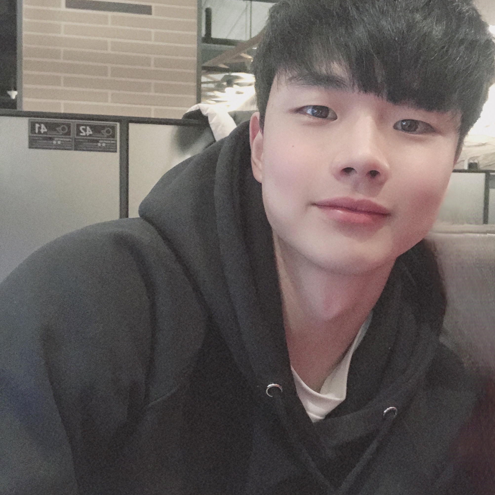
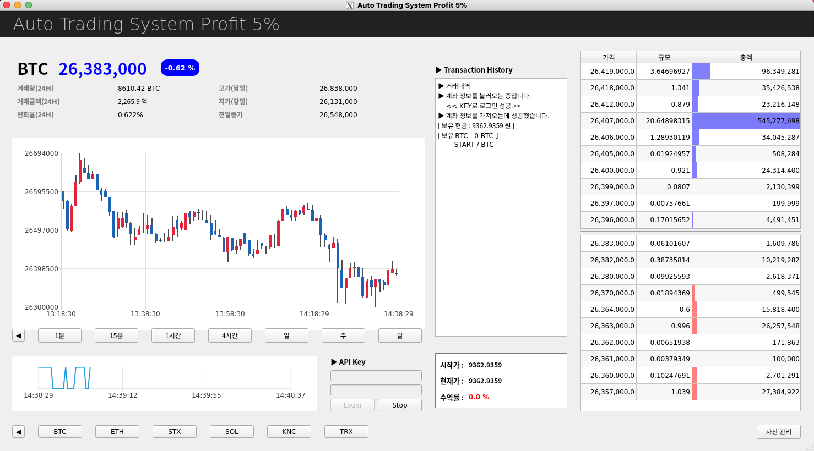
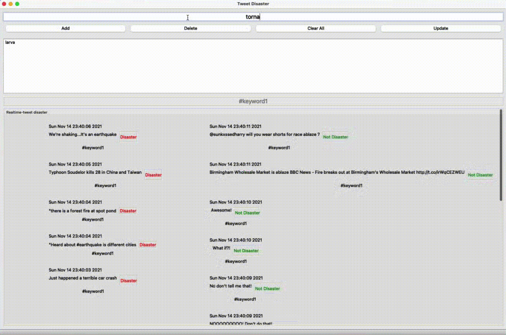
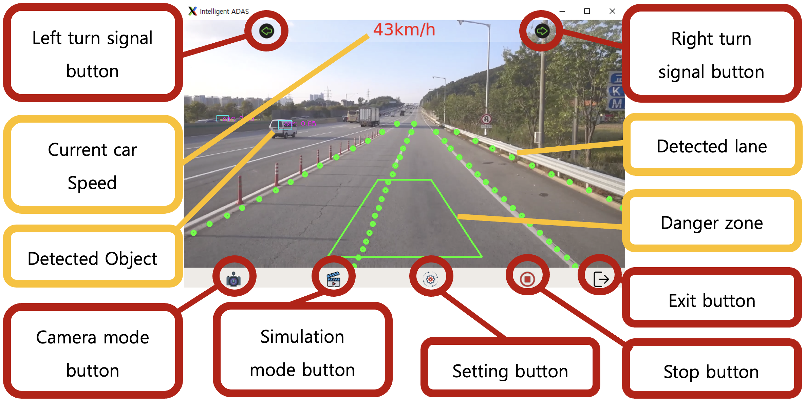
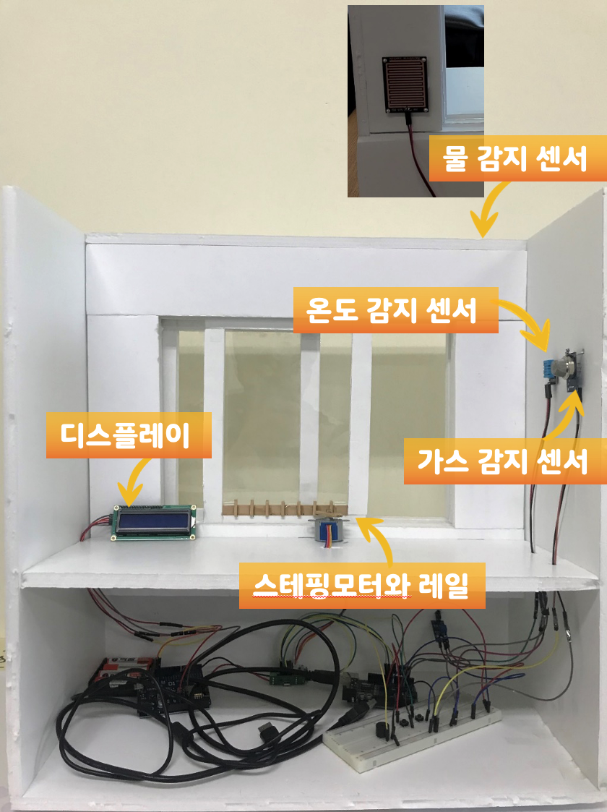
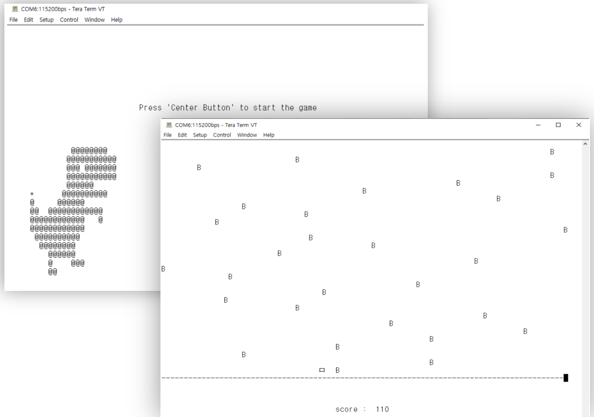

## 이력서

  

#### 안녕하세요 김우석입니다.

- 이름: 김우석

- Email: woosook0127@naver.com

- GitHub: https://github.com/woosook0127 

## 활동

- [Contents Creative Labs](https://sites.google.com/view/cclabs/%ED%99%88) (2021.04 - 현재)

## 

## 사용 기술

### Language

- `Python`, `C`, `C++`
- `Machine Learning` `NLP` `CV` `CNN`
- `Multiprocessing` `Data Analysis` `Serial Communication` 

### Hardware

- `Jetson-nano` `Jetson-Xavier` `Jetson-TX2` 
- `FRDM-k64F` `EK-TM4C1294XL` `ESP8266` `Mbed Application Shield` 
- `NUCLEO-F446RE` `SX1272MB2DAS`  

### Process

- 모니터링 - `Github`
- 커뮤니티 - `Slack`
- 이슈관리 - `Github` `Notion` 
- 버전관리 - `Git` 

 
  

## 프로젝트

### [CoinATS](https://github.com/woosook0127/CoinATS)
- 기간 : 2022.02 ~ 현재
- 소개 : 24시간 트레이딩이 어려운 암호화폐 시장에서 자동 거래 시스템을 구축하여 수익을 실현하는 서비스
- 역할 : 거래 기법을 구현하고 UI와 연결, 프로그램 안정화와 오류 처리
- 사용한 Skill 또는 지식 : Python, PyQt, Coin trading strategy, Time-series analysis, Prophet
  

### [SelfDriving&Parking](https://github.com/woosook0127/SelfParking)
- 기간 : 2022.02 ~ 현재
- 소개 : jetson nano와 4개의 카메라만을 가지고 자율 주차 및 간단한 자율 주행을 구현
- 역할 : image segmentation으로 객체 거리 추출, Reinforces learning으로 자율 주차 구현
- 사용한 Skill 또는 지식 : Python, Pytorch, TensorFlow, Reinforced learning, Supervised learning, image segmentation, bird eye's view
  

### [NLP Project](https://github.com/woosook0127/ML_Project)
- 기간 : 2021.09 ~ 2021.12
- 소개 : 트위터에 등록되는 트윗을 자연어 처리를 통해 분석하여 자연 재해 상황을 예측한다
- 역할 : 재난 관련 트위터를 검색하기 위한 hash tag 생성, TF-IDF와 RidgeClassifer를 사용하여 예측 모델 생성
- 사용한 Skill 또는 지식 : Python, PyQt, Binary Classification, Text Vectorization, 
  

### [HousePrice Precdiction](https://github.com/woosook0127/BigdataApplicationProject)
- 기간 : 2022.03 ~ 2022.06
- 소개 : 최근 1년 간 서울시 집 값 데이터로 학습된 모델을 가지고 현재 저평가된 지역과 고평가된 지역을 예측하여 부동산 매매에 도움을 주는 서비스
- 역할 : 데이터 수집 및 조작, 데이터 변형 및 정제, 모델 학습, 모델 선정
- 사용한 Skill 또는 지식 : Python, Pandas, Matplotlib, Regressor, Data crawling, Data analysis, Data manipulate, Regular function,

### [ADAS](https://github.com/woosook0127/SM-R320-adas)
- 기간 : 2021.06 ~ 2022.02
- 소개 : jetson nano와 카메라 1대를 사용해 운전자가 주행 중 과속, 차선 이탈, 추돌 위험 상황에 취했을 때 경고 해 주는 주행 보조 시스템으로 30FPS 및 경고 precision 95%를 보장한다.
- 역할 : Train & Test Data Generation, Debugging, Image Cleaning, Warning 제어 프로세스 개발, 
        UI 개선, GPS data 처리, Manual 작성, System optimization, Performance Imprvements
- 사용한 Skill 또는 지식 : Python, Pytorch, Object detection, Lane detection, Image & Video manipulation, Jetson nano, GPS data
 

### [Smart Window]
- 기간 : 2021.03 ~ 2021.06
- 소개 : Ardino와 여러 가지 센서들을 이용해 주변 기상 상황을 감지하여 창문을 개폐하고 WiFi module ESP 8266을 사용해 기상 정보를 제공하는 스마트 윈도우 개발
- 역할 : 기상청 API와 WiFi 통신을 사용해 Arduino에 기상 정보를 수신하여 이를 display, 하드웨어 재단 및 조립
- 사용한 Skill 또는 지식 : Arduino, ESP8266, XML data manipulation, WiFi communication
 

### [Embedded Gamer]
- 기간 : 2021.03 ~ 2021.06
- 소개 : FRDM K64F보드와 Mbed application shield 및 ESP8266 module을 사용한 http 통신을 사용해 두 가지 게임 구현
- 역할 : 사용해 게임 Jumping Dino 구현, 사용해 서버에서 게임 모드 변경 구현, System Debugging
- 사용한 Skill 또는 지식 : UART programming, http communication, Mbed API, PWM control, Real-time programming, NodeMCU, Pass through connection
 

## 수상 경력

**상명대학교 2021-1학기 스터디상생플러스 (최우수)**

- 수상 날짜: 2020.09
